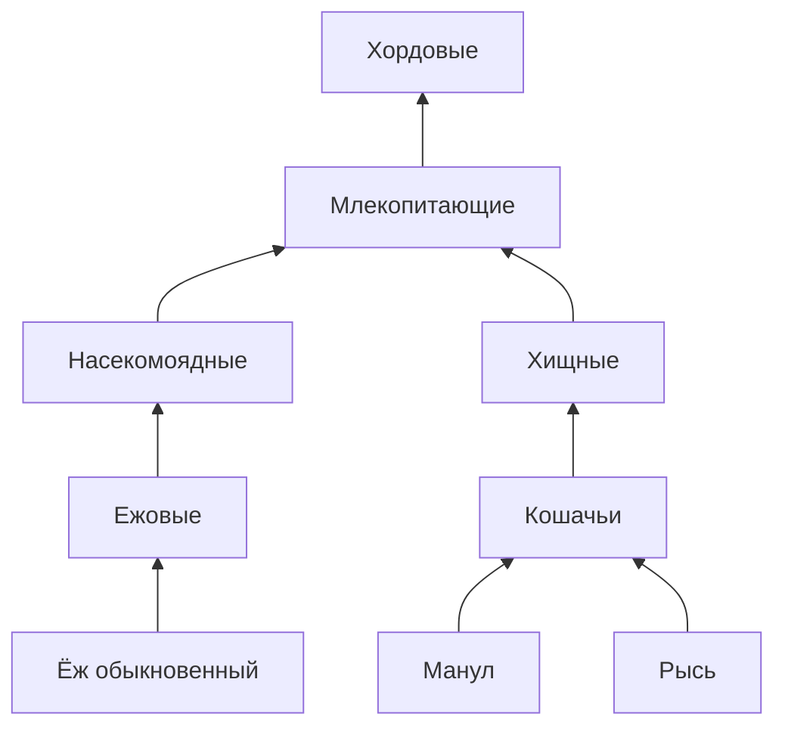

Этот репозиторий содержит решения лабораторных работ по дисциплине "Объектно-ориентированное программирование" в
Санкт-Петербургском политехническом университете Петра Великого.

- **Язык:** Java
- **Технологии:** Stream API, Reflection API, Multithreading (wait/notify)

---

1. [Шаблон "Стратегия"](#1-шаблон-стратегия) [`1-pattern-strategy-movement`](1-pattern-strategy-movement)
2. [Аннотации и рефлексия](#2-аннотации-и-рефлексия) [`2-custom-annotation-processor`](2-custom-annotation-processor)
3. [Generics и иерархия](#3-Generics-и-иерархия) [`3-generics-hierarchy`](3-generics-hierarchy)
4. [Программа-переводчик](#4-программа-переводчик) [`4-translator`](4-translator)
5. [Stream API](#5-stream-api) [`5-stream-api`](5-stream-api)
6. [Многопоточность](#6-многопоточность) [`6-wait-notify-supervisor`](6-wait-notify-supervisor)

---

### 1. Шаблон "Стратегия"

В компьютерной игре герой (класс `Hero`) может перемещаться между двумя точками (метод `move`) различными способами:
идти пешком, ехать на лошади, лететь и т. п. Реализовать классы, позволяющие выбирать и менять **в ходе выполнения
программы** способ перемещения героя, используя паттерн “стратегия” (`strategy`). Продемонстрировать работу
реализованных классов.

---

### 2. Аннотации и рефлексия

Написать аннотацию с целочисленным параметром. Создать класс, содержащий публичные, защищенные и приватные методы (2-3
каждого вида) с параметрами, аннотировать любые из них. Вызвать из другого класса все аннотированные защищенные и
приватные методы столько раз, сколько указано в параметре аннотации.

---

### 3. Generics и иерархия

Дана иерархия животного царства:


Создать метод `segregate` вида:  
`segregate(SrcCollection, Collection1, Collection2, Collection3)`  
Где:

- `SrcCollection` – исходная коллекция животных.
- `Collection1`, `Collection2`, `Collection3` – коллекции, в которые должны быть распределены соответственно ежи, манулы
  и рыси из `SrcCollection`.

Необходимо, чтобы была возможность вызвать метод следующими способами:  

```
segregate(Млекопитающие, Ежовые, Кошачьи, Хищные);
segregate(Хищные, Хордовые, Манулы, Кошачьи);
segregate(Ежовые, Насекомоядные, Хищные, Хищные);
```

Продемонстрировать работу метода

---

### 4. Программа-переводчик

Реализовать программу-переводчик.

1. При запуске программы выполняется чтение словаря в следующем формате: `слово или выражение | перевод`
2. Затем читается входной файл и выполняется перевод
3. Перевод осуществляется по следующим правилам:
    - Регистр букв игнорируется
    - Если искомого слова нет в словаре – выводится без перевода
    - Если есть несколько подходящих вариантов, выбирается вариант с максимальной длиной левой части
4. Результат перевода выводится в консоль
5. Создать и применить пользовательские исключения:
    - `InvalidFileFormatException`: см. пункт 1;
    - `FileReadException`: файла не существует, нет доступа к файлу и т.д.

---

### 5. Stream API

С использованием только `Stream API` реализовать следующие методы:

- метод, возвращающий среднее значение списка целых чисел;
- метод, приводящий все строки в списке в верхний регистр и добавляющий к ним префикс `_new_`;
- метод, возвращающий список квадратов всех встречающихся только один раз элементов списка;
- метод, принимающий на вход коллекцию строк и возвращающий все строки, начинающиеся с заданной буквы, отсортированные
  по алфавиту;
- метод, принимающий на вход коллекцию и возвращающий ее последний элемент или кидающий исключение, если коллекция
  пуста;
- метод, принимающий на вход **массив** целых чисел и возвращающий сумму чётных чисел или 0, если чётных чисел нет;
- метод, преобразовывающий все строки в списке в `Map`, где первый символ – ключ, а оставшиеся символы – значение;

---

### 6. Многопоточность

Создать супервизор (управляющую программу), которая контролирует исполнение абстрактной программы.

Абстрактная программа работает в отдельном потоке и является классом с полем перечисляемого типа, который отражает ее
состояние

- `UNKNOWN` – перед первым запуском
- `STOPPING` - остановлена
- `RUNNING` - работает
- `FATAL ERROR` – критическая ошибка

и имеет поток-демон случайного состояния, который в заданном интервале меняет её состояние на случайное.

У супервизора должны быть методы остановки и запуска абстрактной программы, которые меняют ее состояние. Супервизор
является потоком, который циклически опрашивает абстрактную программу, и если ее состояние `STOPPING`, то перезапускает
ее. Если состояние `FATAL ERROR`, то работа абстрактной программы завершается супервизором. Все изменения состояний
должны сопровождаться соответствующими сообщениями в консоли. Супервизор не должен пропустить ни одного статуса
абстрактной программы. Использовать конструкции с `wait/notify`.